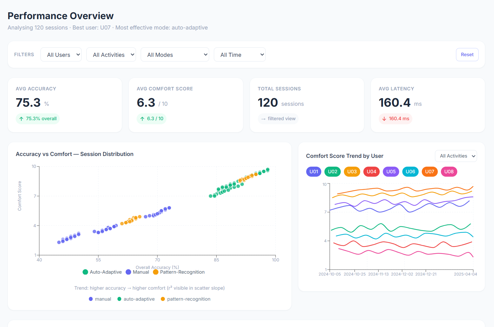
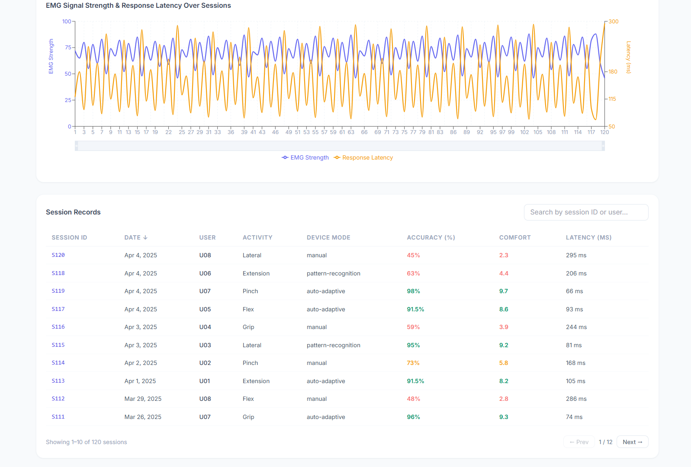

<div align="center">
  
# 🦾 Prosthetic Performance Analysis
  
**A full-stack dashboard for analyzing simulated EMG sensor data and prosthetic usage patterns.**

[](https://opensource.org/licenses/MIT)
[](https://reactjs.org/)
[](https://vitejs.dev/)
[](https://tailwindcss.com/)
[](https://expressjs.com/)

</div>

---

## 📖 Overview

Prosthetic Performance Analysis is an analytical web application designed to help researchers, clinicians, and engineers understand the relationship between prosthetic device accuracy and user comfort. 

By analyzing 120 realistic session records across 8 distinct users, the dashboard surfaces critical insights—such as how device accuracy (grip and movement precision) directly impacts user comfort, and how factors like calibration drift and response latency negatively affect performance.

### ✨ Key Features

- **📊 Interactive Analytics:** Scatter plots with regression lines, multi-line trend charts, and dual-axis EMG signal charts built with Recharts.
- **🎛️ Dynamic Filtering:** Global state management to filter data instantly by User, Activity Type, Device Mode, and Date Range.
- **🔍 Deep Dive Sessions:** Detailed session views featuring multi-metric, normalized Radar charts.
- **⚡ Lightning Fast:** Powered by Vite and React 18 for instantaneous hot module replacement and optimized production builds.
- **🐳 Docker Ready:** Multi-stage Dockerfile provided out-of-the-box for seamless containerized deployment.

---

## 📸 Screenshots


| Dashboard Overview | Session Details |
|:---:|:---:|
|  |  |

---

## 🛠️ Technology Stack

**Frontend:**
- [React 18](https://reactjs.org/)
- [Vite](https://vitejs.dev/)
- [Tailwind CSS](https://tailwindcss.com/)
- [Recharts](https://recharts.org/)
- [React Router v6](https://reactrouter.com/)

**Backend:**
- [Node.js](https://nodejs.org/)
- [Express](https://expressjs.com/)
- JSON file-based database for simplicity and rapid prototyping

---

## 🚀 Getting Started

Follow these instructions to get a copy of the project up and running on your local machine.

### Prerequisites

Ensure you have the following installed:
- Node.js (v18 or higher)
- npm or yarn

### 1. Installation

Clone the repository and install dependencies from the root directory:

```bash
git clone https://github.com/yourusername/prosthetic-performance-analysis.git
cd prosthetic-performance-analysis

# Install root dependencies (concurrently)
npm install

# Install client and server dependencies
cd client && npm install
cd ../server && npm install
cd ..
```

### 2. Running Locally (Development)

You can run both the frontend and backend simultaneously using the provided root script:

```bash
npm run dev
```

- **Frontend:** [http://localhost:5173](http://localhost:5173)
- **Backend API:** [http://localhost:5000](http://localhost:5000)

### 3. Build & Run with Docker

To run the application in an isolated container environment:

```bash
docker-compose up --build
```
The production-ready app will be available at [http://localhost:8080](http://localhost:8080).

---

## 📡 API Reference

The local Express backend serves the following RESTful endpoints:

| Endpoint | Method | Description | Query Parameters |
|----------|--------|-------------|------------------|
| `/api/sessions` | `GET` | Fetches session array | `userId`, `activityType`, `deviceMode`, `dateRange` |
| `/api/sessions/:id` | `GET` | Fetches a single session by `id` | - |
| `/api/summary` | `GET` | Aggregated KPI scores | - |
| `/api/accuracy-comfort` | `GET` | Scatter plot data subset | - |
| `/health` | `GET` | Server health check | - |

---

## 🤝 Contributing

Contributions are what make the open-source community such an amazing place to learn, inspire, and create. Any contributions you make are **greatly appreciated**.

Please see our [CONTRIBUTING.md](CONTRIBUTING.md) for detailed guidelines.

1. Fork the Project
2. Create your Feature Branch (`git checkout -b feature/AmazingFeature`)
3. Commit your Changes (`git commit -m 'Add some AmazingFeature'`)
4. Push to the Branch (`git push origin feature/AmazingFeature`)
5. Open a Pull Request

---

## 📄 License

Distributed under the MIT License. See `LICENSE` for more information.

---

